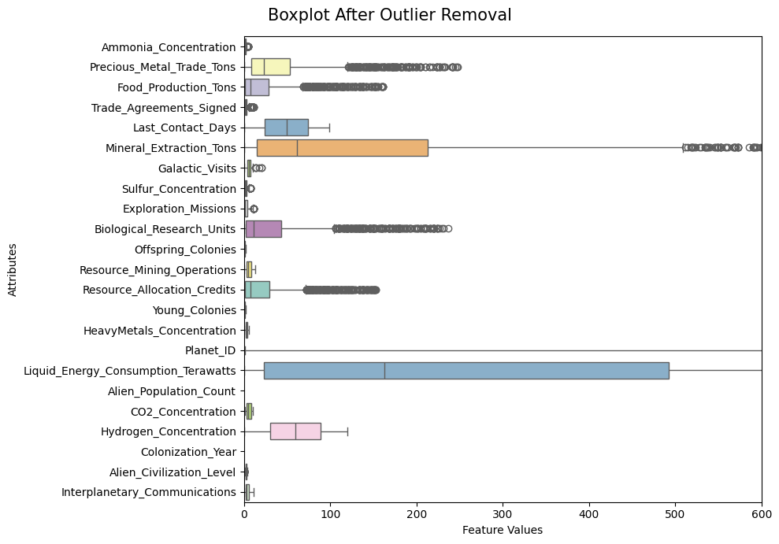

# Alien Galaxy Clustering Project

**Author:** Sevgi Muratova  

**Student ID:** 304631  

---

## Introduction

In the distant future, alien civilizations have colonized planets across the galaxy, each exhibiting distinct environmental, technological, and social characteristics.

Dataset `alien_galaxy.csv` provides attributes of alien civilizations colonizing planets across the galaxy. Each row represents a planet, and each feature captures an aspect of civilization development — such as resource production, technological progress, colonization activity, or social structures.

The main goal of this project is to:

- Discover natural clusters of civilizations.

- Understand which features differentiate civilizations (e.g., resources, exploration, diplomacy).

- Provide insights into why certain planets are more attractive for colonization.

The project includes preprocessing, clustering using multiple algorithms, visualization, and performance evaluation.

---

### Dataset Exploration

The dataset contains **2140 planets × 34 features**

Most features are **numerical** (resource counts, production, concentrations).

Three categorical features:

- *Alien_Civilization_Level* (education/advancement).

- *Dominant_Species_Social_Structure* (married, single, divorced, etc.).

- *Discovery_Date* (string dates, later dropped).

---

## Data Cleaning & Preprocessing

1. Dropped identifiers (Planet_ID) and low-value features (Interstellar_Contact_Cost, Galactic_Trade_Revenue).

2. **Missing values**:

- Checked % missing per feature.
- For numeric: used KNN Imputer (k=5) → preserved similarity between planets.
-For categorical: encoded and imputed with most frequent values.

3. **Encoding**:

- *Alien_Civilization_Level*: mapped as ordinal (Basic=0, 2n Cycle=1, Graduation=2, Master=3, PhD=4).
- *Dominant_Species_Social_Structure*: one-hot encoded (Married, Single, YOLO, etc.).

4. **Scaling**: used StandardScaler so each feature contributes equally (important for distance-based clustering)

---

### Outlier Detection

Applied Interquartile Range (IQR) filtering with threshold 4×IQR.

Removed ~4% of data as extreme outliers. These outliers (e.g., planets with enormous populations or extraction rates) would otherwise distort clustering.

Correlation Analysis:

After scaling, no correlations exceeded 0.70 → no feature drops necessary.

---

### Feature Reduction

Used PCA for visualization:

- PCA(2) → 2D scatterplots of clusters.

- PCA(3) → 3D scatterplots for better separation.

Explained variance (first 3 PCs): ~65% of total variance.

---

## Experimental Design
- Purpose: Validate clustering approaches on Alien Galaxy data.  
- Baselines: Compared three algorithms (K-Means, Agglomerative, DBSCAN).  
- Evaluation Metric: Silhouette score (primary).  
- Visualization: PCA projections (2D, 3D).  
- Interpretation: Average feature values by cluster.  

---

## Models & Evaluation

---

## Clustering models

We structured our experiments as follows:

- **K-Means**:
Evaluated k ∈ [2,10].

Elbow method showed diminishing returns beyond k=2.

Optimal k=2 with silhouette ≈ 0.196.

**Strength**: clear and simple partition into two large groups.

**Weakness**: oversimplifies the dataset and assumes spherical clusters.

- **Agglomerative**: 
Explored linkages: Ward, Complete, Average, Single.

Ward linkage, k=3 gave the most interpretable structure.

**Silhouette** ≈ 0.216, slightly better than K-Means.

**Advantage**: hierarchical structure allows dendrogram interpretation.

**Limitation***: computationally heavier.

- **DBSCAN**: 
Grid search over eps ∈ [0.1,1.5] and min_samples ∈ [3,10].

***Best configuration**: eps=1.4, min_samples=3, but silhouette ≈ 0.174.

Produced one dominant cluster + scattered noise points.

**Strength**: detects noise/outliers automatically.

**Weakness**: poor separation on this dataset.

---

## Results

### K-Means

**Silhouette** ≈ 0.195.

Two distinct clusters:

- *Cluster 0*: low-resource planets, more exploration, more offspring colonies.

- *Cluster 1*: resource-rich civilizations with high food production, energy consumption, and population.

### Agglomerative Clustering

Average linkage, k=2 → best silhouette (0.216) but trivial (1 big cluster + few small ones).

Ward linkage, k=3 → slightly lower silhouette (~0.20) but produced balanced and interpretable clusters.

### DBSCAN

**Best parameters**: eps=5, min_samples=5.

**Silhouette** ≈ 0.174.

Formed 5 clusters, but most points collapsed into one dense group.

Identified noise points (-1).

---

## Model Comparison

----

## Conclusions

**Best numerical performance**: Agglomerative (average linkage, k=2).

**Best interpretability**: Agglomerative (Ward, k=3) → balanced and meaningful clusters.

**Most robust/simple**: K-Means (k=2) → clear binary split into underdeveloped vs. advanced civilizations.

**Least effective**: DBSCAN → dataset not strongly density-structured.

- The most discriminative features across clusters were:

*Resource & Economy*: Alien Population Count, Liquid Energy Consumption, Mineral Extraction.

*Exploration/Expansion*: Colonization Year, Exploration Missions.

*Diplomacy & Conflict*: Peace Treaties, Military Engagements, Cultural Exchange Programs.

- Cluster average plots showed that:

One cluster had high population and energy use, pointing to established civilizations.
Another cluster had lower resources but higher diplomatic engagement, suggesting “emerging civilizations.”
The intermediate cluster (Agglomerative) balanced both aspects, hinting at civilizations in transition.
Planets that clustered into the high-resource groups (large populations, strong extraction, high energy consumption) are the most likely hubs for colonization and interstellar activity.
Civilizations in the intermediate group may represent attractive diplomatic partners or stepping stones for expansion, as they show potential for growth.
The smaller or resource-limited clusters likely represent less attractive colonies, possibly vulnerable to domination or dependent on stronger civilizations.

---

## Limitations

- PCA reduces complexity but may hide non-linear patterns.

- DBSCAN’s sensitivity to eps/min_samples made results unstable.

- Some features (e.g., categorical encodings) might add noise.

---

## Future Work

- Apply Gaussian Mixture Models (GMMs) for probabilistic clustering.

- Use UMAP/t-SNE for non-linear embeddings before clustering.

- Perform feature importance ranking to drop low-value attributes.